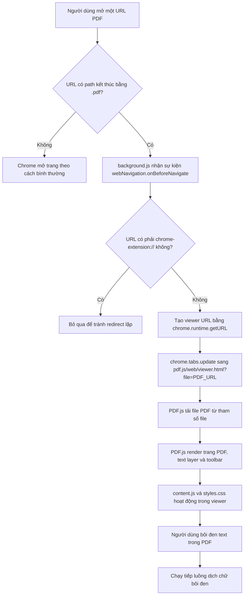
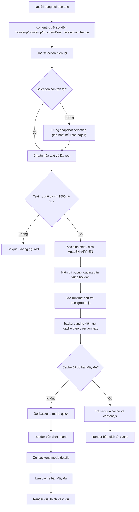
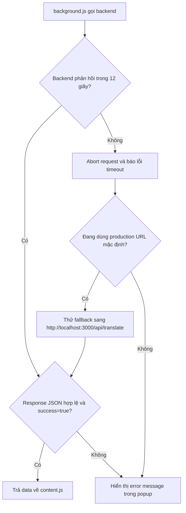

# Quick Viet Translator

Quick Viet Translator là Chrome Extension dịch nhanh văn bản được bôi đen trên website và PDF. Dự án tập trung vào ngữ cảnh đọc paper công nghệ thông tin, vì vậy prompt backend ưu tiên thuật ngữ chuyên ngành, acronym, tên mô hình, thuật toán, dataset, công thức, biến và cách diễn đạt học thuật.

Extension không gọi trực tiếp OpenAI API. Mọi request dịch đi qua Express backend proxy để bảo vệ `OPENAI_API_KEY`.

## Tính năng chính

- Dịch nhanh text được bôi đen trên website bất kỳ.
- Hỗ trợ chiều dịch `EN → VI`, `VI → EN` và `Auto`.
- Tối ưu cho paper CNTT/CS: giữ thuật ngữ, acronym, model, dataset, citation, code identifier và công thức.
- Dịch hai pha: bản dịch nhanh trước, giải thích và ví dụ sau.
- Cache kết quả dịch trong `chrome.storage.local`.
- Popup nổi giao diện pastel, đơn giản, không dùng icon.
- Popup quản lý extension để bật/tắt, chọn chiều dịch, xóa cache và cấu hình backend.
- Hỗ trợ PDF bằng PDF.js viewer tích hợp trong extension.
- Tự inject content script vào các tab đang mở khi extension được reload/cài lại.
- Tối ưu selection cho các website dynamic như Facebook/feed dài: `mouseup`, `pointerup`, `touchend`, `keyup`, `selectionchange`, snapshot selection và định vị popup theo viewport.

## Cấu trúc thư mục

```txt
quick-viet-translator/
├── backend/
│   ├── package.json
│   ├── package-lock.json
│   ├── .env.example
│   └── src/
│       ├── app.js
│       ├── server.js
│       ├── controllers/
│       ├── middlewares/
│       ├── routes/
│       ├── services/
│       └── utils/
├── extension/
│   ├── manifest.json
│   ├── background.js
│   ├── content.js
│   ├── popup.html
│   ├── popup.js
│   ├── styles.css
│   ├── icons/
│   └── pdf.js/
├── render.yaml
└── README.md
```

## Kiến trúc tổng quan

```txt
User bôi đen text
        │
        ▼
content.js hiển thị popup loading
        │
        ▼
background.js nhận message qua runtime port
        │
        ▼
Express backend /api/translate
        │
        ▼
OpenAI API
        │
        ▼
background.js cache kết quả và trả về content.js
        │
        ▼
content.js render bản dịch, giải thích, ví dụ
```

## Backend

Backend là Express app dùng ESM, có nhiệm vụ:

- Nhận request từ extension.
- Validate input bằng `zod`.
- Rate limit request dịch.
- Gọi OpenAI API bằng `openai` SDK.
- Trả JSON ổn định cho extension.
- Không expose API key ra client.

### Endpoint

#### `GET /health`

Kiểm tra backend đang chạy.

Response mẫu:

```json
{
  "status": "ok",
  "message": "Quick Viet Translator backend is running."
}
```

#### `POST /api/translate`

Request body:

```json
{
  "text": "transformer architecture",
  "direction": "en-vi",
  "mode": "quick",
  "translation": ""
}
```

Các giá trị:

- `text`: chuỗi cần dịch, tối đa 1500 ký tự.
- `direction`: `en-vi`, `vi-en` hoặc `auto`.
- `mode`: `quick` hoặc `details`.
- `translation`: bản dịch nhanh, dùng khi gọi `details`.

Response quick mẫu:

```json
{
  "success": true,
  "data": {
    "original": "transformer architecture",
    "translation": "kiến trúc Transformer",
    "type": "technical expression",
    "direction": "en-vi"
  }
}
```

Response details mẫu:

```json
{
  "success": true,
  "data": {
    "explanation": "Cách dịch này giữ nguyên tên kiến trúc Transformer vì đây là thuật ngữ chuẩn trong các paper NLP.",
    "example": "The transformer architecture improves contextual representation learning.",
    "example_vi": "Kiến trúc Transformer cải thiện việc học biểu diễn theo ngữ cảnh."
  }
}
```

## Cài đặt backend local

Yêu cầu:

- Node.js >= 18
- OpenAI API key

Các bước:

```bash
cd quick-viet-translator/backend
npm install
cp .env.example .env
```

Cập nhật `.env`:

```env
PORT=3000
OPENAI_API_KEY=sk-proj-...
NODE_ENV=development
ALLOWED_ORIGIN=*
```

Chạy backend:

```bash
npm start
```

Hoặc dùng nodemon khi phát triển:

```bash
npm run dev
```

Kiểm tra:

```bash
curl http://localhost:3000/health
```

## Cài đặt Chrome Extension

1. Mở Chrome.
2. Vào `chrome://extensions`.
3. Bật `Developer mode`.
4. Chọn `Load unpacked`.
5. Chọn thư mục:

```txt
quick-viet-translator/extension
```

6. Reload extension sau mỗi lần sửa code.

Nếu muốn dịch trên file PDF local `file://...`, bật `Allow access to file URLs` cho extension trong `chrome://extensions`.

## Cấu hình backend trong extension

Popup extension có ô `Backend`.

Có thể nhập:

```txt
http://localhost:3000
```

hoặc backend production:

```txt
https://quick-viet-translator-backend.onrender.com
```

Extension sẽ tự chuẩn hóa thành:

```txt
/api/translate
```

Nếu production backend phản hồi quá lâu, extension có timeout 12 giây và fallback sang local backend khi đang dùng URL production mặc định.

## Sử dụng extension

1. Mở website hoặc PDF.
2. Bôi đen thuật ngữ, câu hoặc đoạn ngắn.
3. Popup dịch sẽ xuất hiện gần vùng bôi đen.
4. Bản dịch nhanh hiển thị trước.
5. Giải thích và ví dụ sẽ được bổ sung sau.
6. Dùng nút `Copy` để sao chép bản dịch.

## Mô phỏng luồng hoạt động

### Luồng mở và hiển thị PDF

Luồng này mô phỏng phần extension phát hiện URL PDF, tạo viewer nội bộ bằng PDF.js, rồi cho phép người dùng bôi đen text trong PDF để dịch.



Các điểm bảo vệ trong luồng PDF:

- `background.js` bỏ qua URL thuộc chính extension để tránh redirect vòng lặp.
- PDF.js được expose trong `web_accessible_resources`.
- `viewer.mjs` được điều chỉnh để cho phép origin `chrome-extension://`.
- Với file local, Chrome cần bật `Allow access to file URLs`.

### Luồng dịch chữ bôi đen

Luồng này mô phỏng phần chính của extension: bắt selection trên website/PDF, hiển thị popup, gọi backend, cache và render kết quả.



Luồng lỗi và timeout:



Các tối ưu giúp chạy tốt trên nhiều website:

- Bắt nhiều loại sự kiện selection thay vì chỉ `mouseup`.
- Lưu snapshot selection để xử lý web dynamic xóa selection quá nhanh.
- Định vị popup theo viewport, không cộng `scrollX/scrollY`, nên hoạt động tốt trên feed dài như Facebook.
- Fallback rect từ `range.getClientRects()` nếu `getBoundingClientRect()` rỗng.
- Chống gọi dịch lặp lại cùng một selection.
- Tự inject `content.js` và `styles.css` vào các tab đang mở khi extension được cài/reload.

## Hỗ trợ PDF

Extension tích hợp PDF.js trong `extension/pdf.js`.

Luồng hoạt động:

- `background.js` bắt điều hướng URL kết thúc bằng `.pdf`.
- Tab được redirect sang `pdf.js/web/viewer.html?file=...`.
- PDF.js render PDF trong extension.
- `content.js` và `styles.css` được expose để popup dịch vẫn hoạt động trong PDF viewer.

Một số lưu ý:

- PDF từ local file cần bật quyền `Allow access to file URLs`.
- PDF từ website cần URL có path kết thúc bằng `.pdf`.
- Một số website dùng viewer riêng hoặc URL tải động không kết thúc bằng `.pdf` có thể không bị intercept.

## Thiết kế prompt

Backend dùng prompt chuyên cho paper CNTT/CS:

- Dịch theo văn phong học thuật.
- Không thêm thông tin ngoài nguồn.
- Giữ acronym và thuật ngữ chuẩn khi tiếng Việt thường dùng dạng tiếng Anh.
- Giữ tên algorithm, model, dataset, citation, formula, code identifier, unit và variable.
- Trả JSON thuần để extension parse ổn định.

Backend gọi hai mode:

- `quick`: trả bản dịch và loại biểu thức.
- `details`: trả giải thích ngắn và ví dụ học thuật.

## Cache và giới hạn request

Extension cache theo key:

```txt
direction:text-normalized
```

Cache nằm trong `chrome.storage.local` và có thể xóa từ popup extension.

Backend có rate limit:

```txt
30 requests / phút
```

## Deploy backend lên Render

Repo có sẵn `render.yaml`.

Cấu hình chính:

- Runtime: Node
- Root dir: `backend`
- Build command: `npm install`
- Start command: `npm start`
- Health check: `/health`

Environment variables cần có:

```txt
OPENAI_API_KEY
NODE_ENV
ALLOWED_ORIGIN
```

Khuyến nghị production:

```txt
ALLOWED_ORIGIN=chrome-extension://<extension-id>
```

Trong giai đoạn phát triển có thể dùng:

```txt
ALLOWED_ORIGIN=*
```

## Kiểm tra nhanh

Kiểm tra cú pháp extension:

```bash
node --check extension/background.js
node --check extension/content.js
node --check extension/popup.js
node --check extension/pdf.js/web/viewer.mjs
```

Kiểm tra manifest:

```bash
node -e "JSON.parse(require('fs').readFileSync('extension/manifest.json','utf8')); console.log('manifest ok')"
```

Kiểm tra backend import được:

```bash
node -e "import('./backend/src/app.js').then(()=>console.log('app import ok'))"
```

Kiểm tra backend local:

```bash
curl http://localhost:3000/health
```

## Troubleshooting

### Không thấy popup dịch trên website

- Reload extension ở `chrome://extensions`.
- Reload tab website nếu tab đã mở từ trước.
- Kiểm tra popup extension xem `Tự động dịch` có đang bật không.
- Một số trang như `chrome://`, Chrome Web Store hoặc trang bị Chrome chặn extension sẽ không chạy content script.
- Với Facebook/feed dài, extension đã có cơ chế bắt `mouseup`, `pointerup`, `touchend`, `keyup`, `selectionchange` và snapshot selection.

### Popup hiện loading lâu

- Kiểm tra backend production có đang ngủ/chết không:

```bash
curl https://quick-viet-translator-backend.onrender.com/health
```

- Chạy backend local và nhập `http://localhost:3000` trong popup extension.
- Kiểm tra `OPENAI_API_KEY` trong backend.

### PDF không mở trong viewer

- Kiểm tra URL PDF có kết thúc bằng `.pdf` không.
- Với file local, bật `Allow access to file URLs`.
- Reload extension sau khi sửa PDF.js hoặc manifest.

### Extension báo error ở Chrome

- Mở `chrome://extensions`.
- Bấm `Errors` ở extension.
- Xem lỗi thuộc `background.js`, `content.js`, `popup.js` hay `viewer.mjs`.
- Chạy lại các lệnh `node --check` ở trên.

## Bảo mật

- Không đặt `OPENAI_API_KEY` trong `extension/`.
- Không gọi OpenAI trực tiếp từ content script hoặc background script.
- API key chỉ nằm ở backend qua biến môi trường.
- `.env` đã nằm trong `.gitignore`.
- Production nên giới hạn CORS bằng extension origin cụ thể.

## Tài liệu thiết kế

Bộ tài liệu thiết kế nằm ở thư mục song song:

```txt
quick-viet-translator-docs/
```

Các file đáng đọc:

- `00_README.md`
- `02_KIEN_TRUC_TONG_THE.md`
- `03_EXTENSION_STRUCTURE.md`
- `04_EXPRESS_BACKEND_PROXY.md`
- `05_API_TRANSLATE_DESIGN.md`
- `06_OPENAI_PROMPT.md`
- `07_BAO_MAT_API_KEY.md`
- `10_CHECKLIST_TEST_DEPLOY.md`

## Trạng thái hiện tại

- Extension chạy theo Manifest V3.
- Backend Express proxy đã có route dịch và health check.
- Prompt đã tối ưu cho paper CNTT/CS.
- UI đã chuyển sang pastel, đơn giản, không dùng icon trong popup dịch và popup extension.
- PDF.js viewer đã được tích hợp và mở khóa origin cho extension.
- Backend production có thể bị cold start hoặc timeout nếu dùng Render free plan; nên có backend local khi phát triển.
